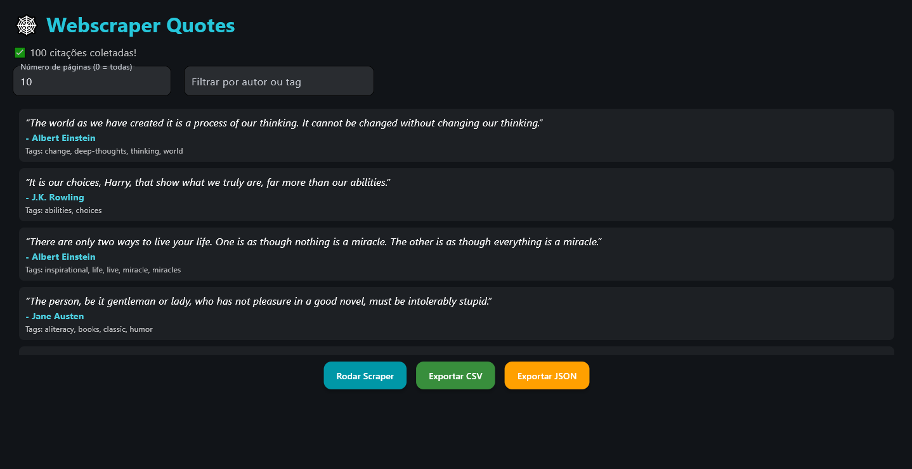

# 🕸️ Webscraper Quotes (Python + Flet)

  
  


Projeto de estudo de **webscraping em Python**, com duas versões:

- **Síncrona** → [`scraper/main.py`](scraper/main.py) (requests + BeautifulSoup)  
- **Assíncrona** → [`scraper/async_scraper.py`](scraper/async_scraper.py) (httpx + asyncio + BeautifulSoup)  
- **Interface Interativa** → [`app.py`](app.py) (Flet UI: escolha de páginas, filtro por autor/tag, exportação CSV/JSON)  

---

## 📸 Preview

Interface moderna construída com **Flet**:



*(adicione aqui seu screenshot ou gif demonstrativo em `docs/preview.png` ou `docs/demo.gif`)*

---

## 🚀 Como rodar

### 1. Clone o repositório
```bash
git clone https://github.com/seu-usuario/webscraper-quotes.git
cd webscraper-quotes
```

### 2. Crie um ambiente virtual
```bash
python -m venv .venv
source .venv/bin/activate   # Linux/macOS
.venv\Scripts\Activate.ps1  # Windows PowerShell
pip install -r requirements.txt
```

### 3. Execute o scraper síncrono
```bash
python scraper/main.py
```

### 4. Execute o scraper assíncrono
```bash
python -m scraper.async_scraper
```

### 5. Rode a interface interativa (Flet)
```bash
python app.py
```

---

## 📂 Saídas

Os dados coletados são salvos na pasta `data/` em formatos:

- `quotes.csv`
- `quotes.json`
- `quotes_ui.csv`
- `quotes_ui.json`

---

## 📖 Notas

- O site usado é [quotes.toscrape.com](http://quotes.toscrape.com), feito para treino de scraping.  
- Sempre respeite `robots.txt` e boas práticas ao coletar dados.  
- O projeto tem fins exclusivamente educacionais.

---

## 📜 Licença

Este projeto é distribuído sob a licença **MIT**.  
Veja o arquivo `LICENSE` para mais detalhes.
